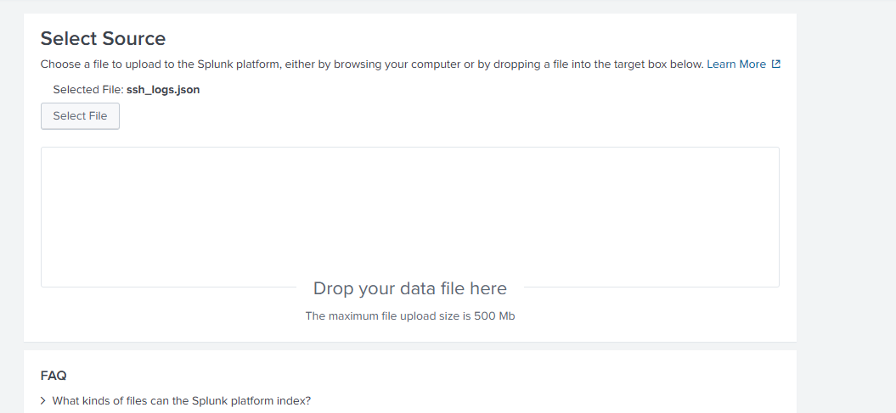
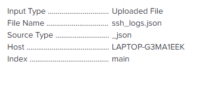
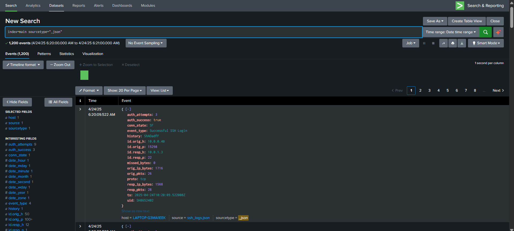
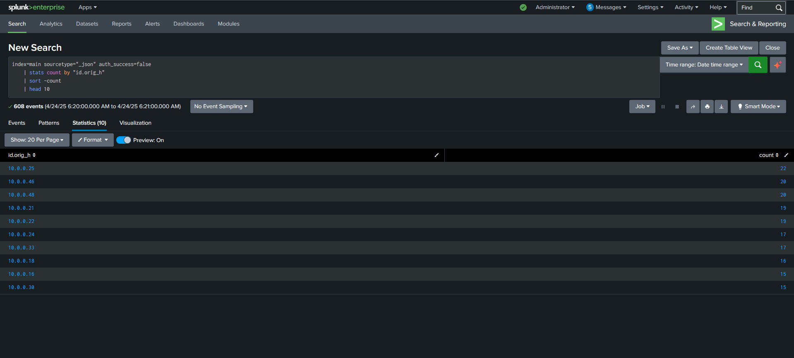
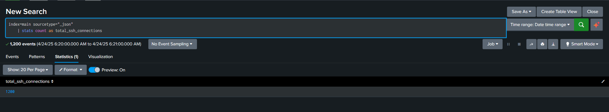
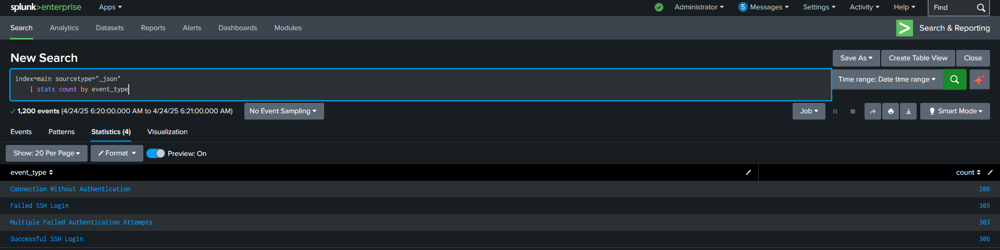

# SSH Log Analysis in Splunk

## Objective

Use Splunk to ingest and analyze SSH logs, detect failed and successful SSH authentication attempts, and identify unusual SSH activity that may indicate brute force or unauthorized access.

### Skills Learned

- SIEM log ingestion and log analysis
- Basic Splunk searching and reporting
- Reviewing failed and successful SSH authentication attempts
- Identifying unusual SSH activity in log data
- Working with JSON-formatted Zeek-style SSH logs

### Tools Used

- Splunk
- SSH logs
- JSON log data
- Zeek-style SSH logs

## Steps

### 1. Upload the SSH Logs into Splunk

I started by uploading the `ssh_logs.json` file into Splunk. To do this, I opened Splunk, went to Settings, selected Add Data, and chose the SSH log file for upload.

### 2. Set the Source Type and Index

After selecting the file, I followed the upload prompts and confirmed the source type and index being used for the data. In this case, the source type was `_json` and the index was `main`.

### 3. Search the Logs

To verify that the data was indexed correctly, I performed a basic search in Splunk using the following query:

    index=main sourcetype="_json"

This query searches the `main` index for events labeled with the `_json` sourcetype. It is a simple way to confirm that the uploaded SSH log file was indexed properly and that the events are searchable.

What I found:  
The search returned the uploaded SSH log events, which confirmed that the file was successfully added to Splunk and that the data was ready for analysis.

Verifying successful ingestion is an important first step in log analysis because missing or improperly indexed data can lead to incomplete investigations and missed security events.

### 4. Review Failed Login Attempts

The first analysis task was to identify the top 10 endpoints with failed SSH login attempts. I used the following query:

    index=main sourcetype="_json" auth_success=false
    | stats count by "id.orig_h"
    | sort -count
    | head 10

This query filters the dataset to failed SSH authentication attempts, counts how many failed logins came from each source IP address, sorts the results from highest to lowest, and displays the top 10 endpoints.

What I found:  
The results showed that several IP addresses generated repeated failed SSH login attempts. The highest count came from `10.0.0.25`, followed by `10.0.0.46` and `10.0.0.48`.

Security implication:  
Repeated failed SSH logins from the same source can be a sign of unauthorized access attempts or brute force activity. Highlighting the most frequent source IPs helps prioritize which endpoints may need further investigation.

### 5. Count Total SSH Connections

The next task was to determine the total number of SSH connections in the dataset. I used the following query:

    index=main sourcetype="_json"
    | stats count as total_ssh_connections

This query counts all SSH log events in the dataset and returns the total as `total_ssh_connections`. It provides a quick baseline view of the overall SSH activity present in the uploaded log file.

What I found:  
The results showed a total of `1200` SSH connections in the dataset. This gave me a better sense of the amount of SSH activity present before breaking the logs down further.

Security implication:  
Establishing a baseline for total SSH activity is useful because it provides context for later analysis. Without that baseline, it is harder to tell whether specific categories of events are rare, expected, or unusually common.

### 6. Review Event Types

For the final task, I counted all event types present in the logs using the following query:

    index=main sourcetype="_json"
    | stats count by event_type

This query groups the events by `event_type` and counts how many times each category appears. It helps break down the overall dataset into the major types of SSH activity it contains.

What I found:  
The results showed four categories of SSH activity:
- Connection Without Authentication: `286`
- Failed SSH Login: `305`
- Multiple Failed Authentication Attempts: `303`
- Successful SSH Login: `306`

This breakdown gave a clearer picture of the authentication-related activity in the dataset and showed that the log file contained a fairly even distribution of different SSH event types.

Security implication:  
Reviewing event types helps analysts understand the kinds of behavior present in a dataset. A mix of successful logins, failed logins, and multiple failed attempts can be useful for spotting suspicious authentication patterns and identifying where deeper investigation may be needed.

## Conclusion

This project helped me build practical experience with SIEM log ingestion, basic Splunk searching, and SSH log analysis. By uploading the dataset, verifying that it was indexed correctly, and running targeted queries, I was able to review failed and successful SSH authentication activity and better understand how Splunk can be used for security monitoring.

One of the main hiccups during this project was troubleshooting the correct source type and query format after uploading the file. At first, getting the search results to appear took some trial and error, but once I confirmed the correct sourcetype and index values, the searches returned the expected results. Working through that issue reinforced the importance of validating ingestion settings before beginning deeper analysis.

Overall, this lab was a useful introduction to reviewing authentication-related events in Splunk. It also showed how even simple queries can provide meaningful security context by surfacing failed logins, establishing a baseline of SSH activity, and breaking the data into event categories that may point to suspicious behavior.
